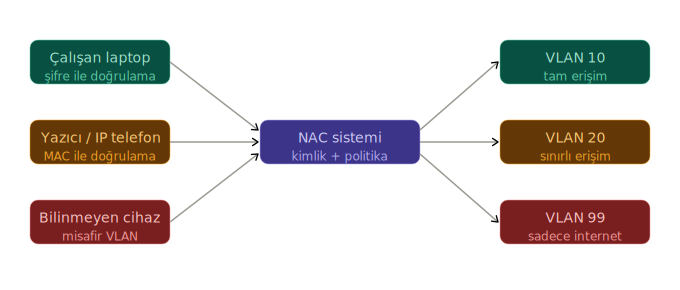

# Network Access Control (NAC) System

Bu proje, ağ erişim güvenliği, yetkilendirme ve cihaz doğrulama süreçlerini (AAA) merkezi olarak yönetmek amacıyla geliştirilmiş, mikroservis mimarisine dayalı bir **Ağ Erişim Kontrol (Network Access Control - NAC)** sistemidir.

---

## 🎯Problem Tanımı

Kurumsal ağlarda farklı türdeki cihazların (çalışan laptopu, yazıcı, bilinmeyen cihazlar) doğru VLAN'a güvenli bir şekilde yönlendirilmesi gerekmektedir:

<p align="center">
  
</p>

---

##  Özellikler

- **Gelişmiş Doğrulama (802.1X & PAP/CHAP):** Ağ cihazlarına (Switch/AP) gelen bağlantı isteklerinin doğrulanması.
- **Mac Authentication Bypass (MAB):** 802.1X desteklemeyen IoT, yazıcı, kamera gibi cihazların MAC adresleri üzerinden ağa dahil edilmesi.
- **Dinamik VLAN Ataması:** Doğrulanan kullanıcıların gruplarına veya cihaz profillerine göre otomatik olarak doğru VLAN'a aktarılması.
- **Brute Force Koruması / Rate Limiting:** Redis kullanılarak çoklu hatalı denemelerin anında engellenmesi.
- **Aktif Oturum Takibi (Accounting):** Ağa bağlanan kullanıcıların ne kadar süre kaldığı, veritabanı ve Redis üzerinden anlık izlenmesi.
- **RESTful Politika Motoru (Policy Engine):** Tüm kimlik doğrulama algoritmaları ve iş kuralları bağımsız bir Python/FastAPI mikroservisi üzerinden çalışır.

---

##  Mimari

Proje tamamen bağımsız konteynerler (Docker) üzerinden birbirleriyle konuşan bileşenlerden oluşur:

<p align="center">
  
</p>

| Bileşen | Teknoloji | Açıklama |
|---------|-----------|----------|
| **AAA Sunucusu** | FreeRADIUS 3.2 | Ağ cihazları (NAS) ile konuşan birinci katman. Gelen RADIUS paketlerini karşılar ve HTTP (REST) üzerinden Policy Engine'e yönlendirir. |
| **Policy Engine** | Python / FastAPI | Sistemin ana beyni. Kullanıcı giriş kurallarını, MAB yetkilendirmelerini ve VLAN politikalarını yönetir. |
| **Veritabanı** | PostgreSQL | Kullanıcılar, gruplar, VLAN reply parametreleri ve Accounting logları burada saklanır. Bcrypt şifreleme ile parolalar güvenli tutulur. |
| **Önbellek** | Redis | Aktif cihazları önbellekte tutar ve rate-limiting hesaplamalarını nanosaniyeler içinde yapar. |

---

##  Kimlik Doğrulama Akışı

Bir kullanıcının ağa bağlanma sürecinde bileşenler arasındaki iletişim adımları:

<p align="center">
  
</p>

---

## 🛠️ Kurulum ve Çalıştırma

Projenin çalışabilmesi için sisteminizde **Docker** ve **Docker Compose** kurulu olmalıdır.

1. Proje ana dizinine gidin:
   ```bash
   cd nac-sistemi
   ```
2. Konteynerleri ayağa kaldırın:
   ```bash
   docker-compose up -d --build
   ```
3. Servislerin düzgün çalışıp çalışmadığını kontrol edin:
   ```bash
   docker-compose ps
   ```
4. Test verilerini yükleyin:
   ```bash
   docker exec nac_api python seed.py
   ```

---

##  Test Komutları

> **ÖNEMLİ:** Test öncesi `seed.py` çalıştırıldığından emin olun:
> ```
> docker exec nac_api python seed.py
> ```

### 1. PAP Authentication (Kullanıcı Adı/Şifre Doğrulama)

**✅ Başarılı Giriş**
```powershell
docker exec nac_freeradius radtest admin_user 123456 localhost 0 testing123
```
**Beklenen:** `Access-Accept` + `Tunnel-Private-Group-Id = "10"` (admin VLAN)

**❌ Yanlış Şifre**
```powershell
docker exec nac_freeradius radtest admin_user yanlis_sifre localhost 0 testing123
```
**Beklenen:** `Access-Reject` (401 - Yanlış Şifre)

**❌ Olmayan Kullanıcı**
```powershell
docker exec nac_freeradius radtest olmayan_kullanici 123456 localhost 0 testing123
```
**Beklenen:** `Access-Reject`

---

### 2. MAB (MAC Authentication Bypass)

**✅ Bilinen MAC Adresi (Yazıcı - Employee VLAN)**
```powershell
docker exec nac_freeradius sh -c "echo 'User-Name=AA:BB:CC:DD:EE:FF,User-Password=AA:BB:CC:DD:EE:FF,Calling-Station-Id=AA:BB:CC:DD:EE:FF' | radclient -x localhost auth testing123"
```
**Beklenen:** `Access-Accept` + `Tunnel-Private-Group-Id = "20"` (employee VLAN)

**✅ Bilinmeyen MAC Adresi (Guest VLAN'a düşer)**
```powershell
docker exec nac_freeradius sh -c "echo 'User-Name=11:22:33:44:55:66,User-Password=11:22:33:44:55:66,Calling-Station-Id=11:22:33:44:55:66' | radclient -x localhost auth testing123"
```
**Beklenen:** `Access-Accept` + `Tunnel-Private-Group-Id = "99"` (guest VLAN)

---

### 3. Accounting (Oturum Kayıtları)

** Accounting Start (Oturum Başlangıcı)**
```powershell
docker exec nac_freeradius sh -c "echo 'User-Name=admin_user,Acct-Status-Type=Start,Acct-Session-Id=test-session-001,NAS-IP-Address=192.168.1.1' | radclient -x localhost acct testing123"
```
**Beklenen:** `Accounting-Response`

** Accounting Interim-Update (Ara Güncelleme)**
```powershell
docker exec nac_freeradius sh -c "echo 'User-Name=admin_user,Acct-Status-Type=Interim-Update,Acct-Session-Id=test-session-001,NAS-IP-Address=192.168.1.1,Acct-Session-Time=120,Acct-Input-Octets=50000,Acct-Output-Octets=80000' | radclient -x localhost acct testing123"
```
**Beklenen:** `Accounting-Response`

** Accounting Stop (Oturum Kapanışı)**
```powershell
docker exec nac_freeradius sh -c "echo 'User-Name=admin_user,Acct-Status-Type=Stop,Acct-Session-Id=test-session-001,NAS-IP-Address=192.168.1.1,Acct-Session-Time=300,Acct-Input-Octets=150000,Acct-Output-Octets=200000,Acct-Terminate-Cause=User-Request' | radclient -x localhost acct testing123"
```
**Beklenen:** `Accounting-Response`

---

### 4. FastAPI Endpoint Testleri (curl)

** Kullanıcı Listesi**
```powershell
curl http://localhost:8000/user
```
**Beklenen:** `{"users":["admin_user"]}`

** API Üzerinden Auth Testi**
```powershell
curl -X POST http://localhost:8000/auth -H "Content-Type: application/json" -d "{\"User-Name\":\"admin_user\",\"User-Password\":\"123456\"}"
```
**Beklenen:** `{}` (HTTP 200 = başarılı)

** API Üzerinden Authorize Testi**
```powershell
curl -X POST http://localhost:8000/authorize -H "Content-Type: application/json" -d "{\"User-Name\":\"admin_user\"}"
```
**Beklenen:** `{"reply:Tunnel-Private-Group-Id":"10"}`

** Aktif Oturumlar (Redis)**
```powershell
curl http://localhost:8000/sessions/active
```
**Beklenen:** Aktif oturum varsa oturum bilgileri, yoksa `{"active_sessions":[],"count":0}`

** MAB Testi (API)**
```powershell
curl -X POST http://localhost:8000/mab -H "Content-Type: application/json" -d "{\"Calling-Station-Id\":\"AA:BB:CC:DD:EE:FF\",\"User-Name\":\"AA:BB:CC:DD:EE:FF\"}"
```
**Beklenen:** `{"reply:Tunnel-Private-Group-Id":"20","control:Auth-Type":"Accept"}`

---

### 5. Rate Limiting Testi

5 kez üst üste yanlış şifre ile giriş yapın, sonra doğru şifreyi deneyin:

```powershell
# 5 kez yanlış şifre
docker exec nac_freeradius radtest admin_user yanlis localhost 0 testing123

# 6. deneme - doğru şifre bile olsa reject almalı
docker exec nac_freeradius radtest admin_user 123456 localhost 0 testing123
```
**Beklenen:** 5 başarısız denemeden sonra doğru şifre de `Access-Reject` döner (5 dakika boyunca)

**Rate Limit Sıfırlama (Redis):**
```powershell
docker exec nac_redis redis-cli DEL "rate_limit:admin_user"
```

---

### 6. Veritabanı Kontrolleri

**Accounting Kayıtlarını Görüntüle**
```powershell
docker exec nac_postgres psql -U nac_user -d nac_db -c "SELECT acctsessionid, username, nasipaddress, acctstarttime, acctstoptime FROM radacct;"
```

**Kullanıcı/Grup Bilgileri**
```powershell
docker exec nac_postgres psql -U nac_user -d nac_db -c "SELECT * FROM radusergroup;"
```

**VLAN Politikaları**
```powershell
docker exec nac_postgres psql -U nac_user -d nac_db -c "SELECT * FROM radgroupreply;"
```

**Kayıtlı MAC Adresleri**
```powershell
docker exec nac_postgres psql -U nac_user -d nac_db -c "SELECT * FROM mac_addresses;"
```
